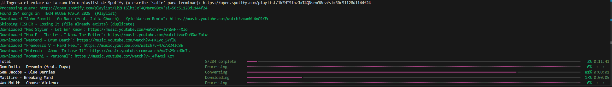
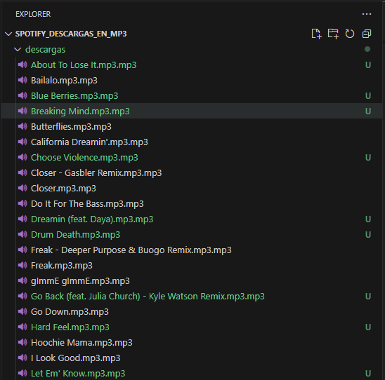

# Spotify Descargas en MP3

Este proyecto permite descargar canciones y playlists de Spotify en formato MP3 con metadatos completos utilizando `spotdl`. Proporciona una solución eficiente para almacenar tu música favorita en archivos locales con información detallada de cada pista.

## Características
- Descarga canciones individuales y listas de reproducción completas de Spotify.
- Guarda los archivos en formato MP3 con metadatos, incluyendo nombre del artista, álbum, portada, etc.
- Compatible con múltiples sistemas operativos (Windows, macOS y Linux).
- Interfaz de línea de comandos sencilla para una experiencia de usuario intuitiva.
- Descargas organizadas en la carpeta `descargas` dentro del directorio del script.

## Capturas de pantalla
A continuación, se muestran algunas imágenes del funcionamiento del script:

### Descargando una playlist completa


### Canciones descargadas en la carpeta `descargas`


## Requisitos del Sistema
Antes de ejecutar el proyecto, asegúrate de cumplir con los siguientes requisitos:
- **Python**: Versión 3.10 o superior.
- **FFmpeg**: Necesario para la conversión de audio.
- **Pip**: Administrador de paquetes de Python para instalar dependencias.

## Instalación
Sigue estos pasos para configurar el proyecto en tu sistema:

### 1. Clonar el repositorio
```bash
git clone https://github.com/monrroyag/spotify-descargas-en-mp3.git
cd spotify-descargas-en-mp3
```

### 2. Instalar dependencias
```bash
pip install -r requirements.txt
```

### 3. Instalar FFmpeg
El software FFmpeg es necesario para la conversión de audio.

#### En Linux (Ubuntu/Debian)
```bash
sudo apt update && sudo apt install ffmpeg
```

#### En macOS
```bash
brew install ffmpeg
```

#### En Windows
Descargar FFmpeg

- Ve a la página oficial: https://ffmpeg.org/download.html.
- En la sección Windows, elige una versión precompilada (por ejemplo, desde Gyan.dev o BtbN).
- Descarga el archivo ZIP.
- Extraer los archivos

- Extrae el contenido del ZIP en una carpeta, por ejemplo: C:\ffmpeg.

Configurar la variable de entorno

- Abre el Explorador de archivos y copia la ruta donde extraíste FFmpeg (ejemplo: C:\ffmpeg\bin).
- Presiona Win + R, escribe sysdm.cpl y presiona Enter.
- Ve a la pestaña Opciones avanzadas → Variables de entorno.
- En Variables del sistema, selecciona Path y haz clic en Editar.
- Agrega una nueva entrada con la ruta C:\ffmpeg\bin y guarda los cambios.

Verificar instalación

- Abre Símbolo del sistema (Win + R, escribe cmd y presiona Enter).
- Escribe ffmpeg -version y presiona Enter.
- Si la instalación fue exitosa, verás información sobre FFmpeg.

## Uso del Script
Ejecuta el siguiente comando para iniciar la descarga de canciones o listas de reproducción:
```bash
python spotify_music_downloader.py
```
El script solicitará un enlace de Spotify y procederá a la descarga. Los archivos se almacenarán en la carpeta `descargas` dentro del directorio donde ejecutaste el script.

## Ejemplo de Uso
1. Al ejecutar el script, se te pedirá que ingreses un enlace de Spotify.
2. Puedes pegar el enlace de una canción o playlist.
3. La descarga comenzará automáticamente y los archivos MP3 se guardarán en la carpeta `descargas`.

## Licencia
Este proyecto está bajo la Licencia MIT. Consulta el archivo `LICENSE` para más detalles.

## Contribución
Si deseas contribuir a este proyecto, por favor sigue estos pasos:
1. Haz un fork del repositorio.
2. Crea una nueva rama para tus cambios.
3. Realiza tus modificaciones y sube los cambios.
4. Abre un Pull Request para su revisión.

## Contacto
Para cualquier consulta o sugerencia, puedes abrir un issue en el repositorio o contactarme a través de GitHub.
